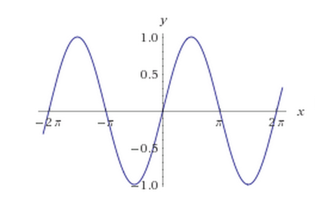

<script>
  (function(i,s,o,g,r,a,m){i['GoogleAnalyticsObject']=r;i[r]=i[r]||function(){
  (i[r].q=i[r].q||[]).push(arguments)},i[r].l=1*new Date();a=s.createElement(o),
  m=s.getElementsByTagName(o)[0];a.async=1;a.src=g;m.parentNode.insertBefore(a,m)
  })(window,document,'script','//www.google-analytics.com/analytics.js','ga');

  ga('create', 'UA-45694234-2', 'auto');
  ga('send', 'pageview');

</script>

#Student Workbook: Introduction to Musical Programming using ChucK
## Joy of Coding Workshop by Bonnie Eisenman

This page is available at [http://blog.bonnieeisenman.com/chuck-workshop/](http://blog.bonnieeisenman.com/chuck-workshop/).

The github repo, which includes code samples, is [bonniee/chuck-workshop](https://github.com/bonniee/chuck-workshop).

[Slides are here.](https://docs.google.com/presentation/d/1BgE_DRwcxRHDGtcQNELAzsQD3-32g9Y_7rEBC3YXQVA/edit?usp=sharing)


## How to Use

This workshop is really a "choose your own adventure"! Feel free to skip around and pick out the bits that sound interesting to you.

The goal of this page is to equip you with a few tools and techniques that will help you explore musical programming with ChucK. The best way to have fun with ChucK is to start coding and experimenting, so our goal is to starting playing as soon as possible. I think you'll find that ChucK lends itself well to live coding and rapid iteration.

Also, you should check out the code samples in [bonniee/chuck-workshop](https://github.com/bonniee/chuck-workshop).

## Table of Contents


- [Introduction to Chuck: Syntax and Setup](#intro)
- [Volume](#volume)
- [Pitch and Frequency](#pitch)
- [Types of Waves](#waves)
- [Vibrato and FM Modulation](#lfo)
- [Overtones](#overtones)
- [Concurrency with Spork](#spork)
- [Envelopes](#env)
- [ADSRs](#adsr)


## <a name="intro"></a>ChucK Intro: Syntax and Setup

### What is ChucK?
ChucK is a musical programming language developed at Princeton. The homepage is here: [http://chuck.cs.princeton.edu](http://chuck.cs.princeton.edu)

The goal of ChucK is sound/music creation and performance. While most programming languages have built-in support for things like numbers and strings, ChucK also focuses on the manipulation of sound and time. It lends itself well to live coding and experimentation. Hopefully you'll find it fun!

Before we begin:

- [Install ChucK](chuck.cs.princeton.edu/release/).
- Decide if you want to use the IDE (MiniAudicle) or the command line.
- Turn your volume down to '0'. Remember that "bugs" in musical programs can produce nasty noises!


### Hello, World (or, Beep!)

The equivalent of "hello world" for musical programs is making them beep! In ChucK, scripts or programs are called 

```
# hello.ck
SinOsc osc => dac;
1::second => now;
```

<audio controls>
  <source src="assets/sound/hello.m4a" type="audio/mp4">
  Your browser does not support the audio tag.
</audio>


The first line creates a _sine wave_ and _chucks_ it to the _dac_. Whoa, that's a lot of new terminology!

- Instead of the assignment operator, `=`, which you might see in other languages, ChucK uses the "chuck" operator, or `=>`.
- _dac_ is shorthand for your audio output (e.g. speakers or headphones). Similarly, _adc_ refers to your microphone. [Docs here.](http://chuck.cs.princeton.edu/doc/program/ugen_full.html#dac)
- A SinOsc is a _unit generator_ that produces sine waves. In ChucK, Unit Generators produce a steady stream of _samples_; basically, they're things that make noise. [SinOsc docs here.](http://chuck.cs.princeton.edu/doc/program/ugen_full.html#sinosc)

A sine wave looks like this:



We perceive a sine wave as a tone, so sending a sine wave to the dac creates an audible noise.

The first line alone won't create any sound, however, because the program will immediately terminate. The second line causes the program to wait for one second. `1::second` creates a _duration_ object; chucking it into _now_ causes the program to wait.


### Basic programming constructs

ChucK is a musical programming language, but it also includes most of the "normal" programming language constructs.

This section is mostly for reference -- skim it, but don't worry about understanding everything!

#### Printing

```
<<< "Hi! This is good for debugging." >>>;
```

#### Variables

Basic types that you may find useful include `float`, `int`, and `dur` (duration).

```
42 => int answer;
525600::minute => dur measureAYear;
6.28 => float tau;
```
[More on types.](http://chuck.cs.princeton.edu/doc/language/type.html)


#### Arrays

[Docs.](http://chuck.cs.princeton.edu/doc/language/array.html)

Arrays are useful for storing things like note values, rhythms, and so on.

```
int foo[10];
[55, 57, 59, 55] @=> int notes[];
```

ChucK also support associative and multidimensional arrays.

#### Loops

ChucK supports `for` and `while`.

```
for (0 => int i; i < 10; i++)
{
  <<< "loops are cool I guess" >>>;
}
```

```
while (true)
{
  <<< "This can be useful for looping audio indefinitely." >>>;
  1::second => now; // Wait 1 second
}
```

#### Functions

```
fun void hey(string s )
{
  <<< "Hello, ", s, "!" >>>;
}
hey("everyboy");
```

#### Classes

ChucK has classes. [Here are the docs](http://chuck.cs.princeton.edu/doc/language/class.html). Once you start working with more complicated synthesis, you'll likely find classes useful.

Example (don't worry too much about the code for now):

```
// classExample.ck
class Note
{
  // pre-constructor, run every time an instance is created
  SinOsc o => Envelope e => dac;
  250::ms => dur tempo;

  fun void quarter(int m)
  {
    Std.mtof(m) => o.freq;
    e.keyOn();
    tempo => now;
    e.keyOff();
  }
}

Note n;
n.quarter(55);
n.quarter(57);
n.quarter(59);
n.quarter(55);
100::ms => now;
```


<audio controls>
  <source src="assets/sound/classExample.m4a" type="audio/mp4">
  Your browser does not support the audio tag.
</audio>


#### Helpful functions

The `Std` [library](chuck.cs.princeton.edu/doc/program/stdlib.html) contains some helpful functions. Also, `Math`!

- `Std.mtof(int midi)` takes a MIDI value (int) and converts it to a frequency in Hz.
- `Math.random2(int min, int max)` is good for adding some variation to your pieces.


## <a name="volume"></a>Manipulating Volume

The perceived __volume__ of a sound is determined by the __amplitude__ of the wave.

We can change amplitude using the `gain` method of any sound-generator (called a `UGen` in Chuck). Like so:

```
SinOsc s => dac;
s.gain(1); // Full volume
1::second => now;
s.gain(0.5); // Half volume
1::second => now;
```

<audio controls>
  <source src="assets/sound/volume.m4a" type="audio/mp4">
  Your browser does not support the audio tag.
</audio>


We can also change gain more rapidly:

```
// changeAmplitude.ck
SinOsc s => dac;
s.freq(Std.mtof(70));
s.gain(0);

for (0=> int i; i < 100; i++)
{
  s.gain(i * .01);
  10::ms => now;
}
```


<audio controls>
  <source src="assets/sound/changeAmplitude.m4a" type="audio/mp4">
  Your browser does not support the audio tag.
</audio>

We can also use the `Gain` UGen to manipulate volume more easily. When two UGens are chucked into the same output, their effects are cumulative. Using a Gain can let us manipulate their volume jointly.

```
// gain.ck	
SinOsc s1 => Gain g => dac;
SinOsc s2 => g;
s1.freq(Std.mtof(70));
s1.gain(0.8);
s2.freq(Std.mtof(72));
s2.gain(0.1);

g.gain(1);
for (200 => int i; i >= 0; i--)
{
  g.gain(i / 100.0);
  10::ms => now;
}
```


<audio controls>
  <source src="assets/sound/gain.m4a" type="audio/mp4">
  Your browser does not support the audio tag.
</audio>

> ## Exercise: Volume and Rhythm
> What kind of rhythms can you generate just by varing volume? Check out `rhythm.ck` for an example, and try creating your own variations.

## <a name="pitch"></a>Pitch and Frequency

The perceived __pitch__ is determined by the frequency of the wave. __Pitch__ is a musical term -- when we talk about pitch we sometimes refer to standard notes (say, a middle C). __Frequency__ is a physical property, and is measured in __Herz__ or __Hz__: the number of cycles a wave makes per second.

Extening `hello.ck` to make two differently-pitched beeps is easy:

```
// hello2.ck
SinOsc osc => Gain g => dac;

.5 => g.gain;
440 => osc.freq;
500::ms => now;

220 => osc.freq;
.25 => g.gain;
1000::ms => now;
```


<audio controls>
  <source src="assets/sound/hello2.m4a" type="audio/mp4">
  Your browser does not support the audio tag.
</audio>


We can also use `Std.mtof` to set frequency using MIDI values, which are usually easier to understand intuitively than raw Herz values. MIDI values map to notes, so for instance, a middle C has a MIDI value of 60.

```
// mtof.ck
SinOsc osc => dac;
for (40 => int i; i < 80; i++)
{
  osc.freq(Std.mtof(i));
  500::ms => now;
}
```

<audio controls>
  <source src="assets/sound/mtof.m4a" type="audio/mp4">
  Your browser does not support the audio tag.
</audio>

Frequency doesn't have to be fixed! Rapidly scaling the frequency can produce neat effects:

```
// slide.ck
SinOsc osc => dac;

fun void slide(int start, int end, int len)
{
  start - end => int gap;
  gap / 200.0 => float step;
  len / 200.0 => float wait;

  osc.gain(1);
  osc.freq(start);
  for (0 => int i; i < 200; i++)
  {
    osc.freq(osc.freq() - step);
    wait::ms => now;
  }
  osc.gain(0);
}

while (true)
{
  slide(200, 50, 150);
  slide(200, 50, 500);
  slide(50, 200, 500);
  slide(100, 300, 500);
  slide(300, 50, 150);
}
```

> ## Exercise: Manipulating Frequency
> What kinds of sound effects can you create solely by manipulating frequency? Note the difference between the "slide up" and "slide down" sounds in `slide.ck`.

> ## Exercise: Playing a Basic Melody
> Now that you know how to control both pitch and volume, try playing a basic melody. Mary Had a Little Lamb, perhaps?


### Below the Threshold: Beats


We hear pitches within a certain frequency range as tones, but as the frequency drops, we'll hear a "beat" instead. Try listening to this with your headphones on.


```
// beat.ck
SinOsc osc => dac;
40 => osc.freq;
2::second => now;
```

<audio controls>
  <source src="assets/sound/beat.m4a" type="audio/mp4">
  Your browser does not support the audio tag.
</audio>

You can actually hear where this threshold happens, too:

```
// pitchdrop.ck
SinOsc osc => Envelope e => dac;
for (180 => int i; i > 40; i--)
{
  osc.freq(i);
  e.keyOn();
  200::ms => now;
  e.keyOff();
  100::ms => now;
}
2::second => now;
```


> ## Excercise: Beat It
> Try adjusting the frequency you used in your earlier rhythm sketch. What does it sound like?


## <a name="waves"></a>Types of waves

Sine, square, triangle, and square waves form the basis of simple sound generation. We've been using mostly sine waves in the examples thus far. Try swapping out sine waves for other kinds and experiment to determine how it changes the perceived sound.

## Programming time!

Hey! You've covered enough at this point that you should be able to try your hand at **composing** (or programming, if you prefer...) some music.

Here are some ideas:

- Try to synthesize an organ-like noise.
- Play Mary Had a Little Lamb.
- Make some weird computer-y noises.
- I dunno, have fun!

It might be useful to use the following constructs:

### Arrays of pitch and duration

Organizing your composition using arrays can be helpful. You can see an example of this here:

```
// Excerpt from motif3.ck
[ [55,Q/2], [55,Q/2], [55,Q/2], [52,Q*2],
  [0,Q/2], [53,Q/2], [53, Q/2], [53,Q/2],
  [50,Q*2] ] @=> int notes[][];

for (0 => int i; i < notes.cap(); i++)
{
  play(notes[i][0], notes[i][1]::ms);
}
```

### Classes

If there's a particular effect you'll want to use often, create a class for it. See the file `classExample.ck`.


## <a name="lfo"></a>Combining Waves: LFOs and Vibrato

```
// lfo.ck
SinOsc s => dac;
SinOsc lfo => blackhole;

440 => s.freq;
5 => lfo.freq;
while (true)
{
  20::ms => now;
  (lfo.last() * 10) + 440 => s.freq;
}
```

A "low frequency oscilator" is just what it sounds like. By modulating the frequency of the main SinOsc, we can create a kind of vibrato effect. What happens when you tweak some of these parameters?

## <a name="overtones"></a>Combining Waves: Adding Overtones

`motif2.ck` is a good example of combining multiple waves to create an effect.

## <a name="spork"></a>Concurrency with spork

ChucK has a concept of __shreds__, which are similar to threads in other languages. You can __spork__ a new shred (yeah, it's like forking a thread, isn't the naming great?).

You can read up about sporking in the [docs](http://chuck.cs.princeton.edu/doc/language/spork.html).

`sporking.ck` is a more complicated example, which shows how multiple kinds of sounds can be combined in a piece via `spork`.


## <a name="env"></a>Envelopes

Envelopes are awesome because they allow you to transition gradually between states. That clicking noise at the begining and end of each note in the `hello.ck` example? It's because we weren't using an envelope.

`envelope.ck` is a very simple example.

```
// envelope.ck
SinOsc s => Envelope e => dac;
s.freq(550);
e.keyOn();
2::second => now;
e.keyOff();
200::ms => now;
```

## <a name="adsr"></a>ADSR and Characteristic Sounds

An __ADSR__ is a special kind of envelope, one that features four paramterers:  attack, decay, sustain, and release. Combined with difference types of waves, an ADSR is a good way to get a particular kind of sound effect. `adsr.ck` is a good example.

> ## Exercise: Sound Synthesis
> Using an ADSR, what kinds of effects can you create?